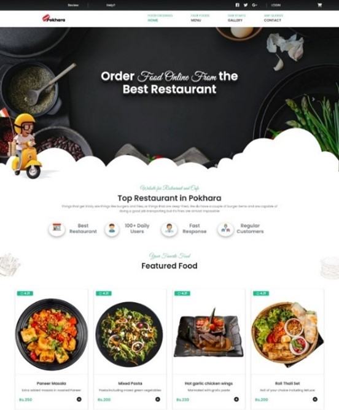
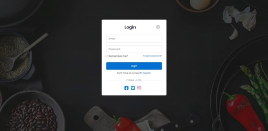
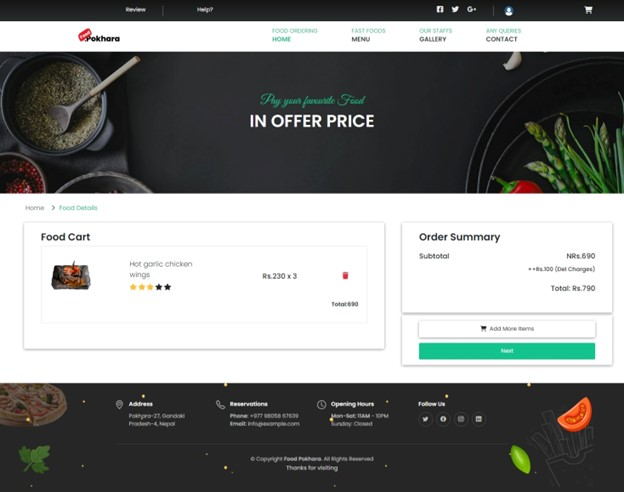
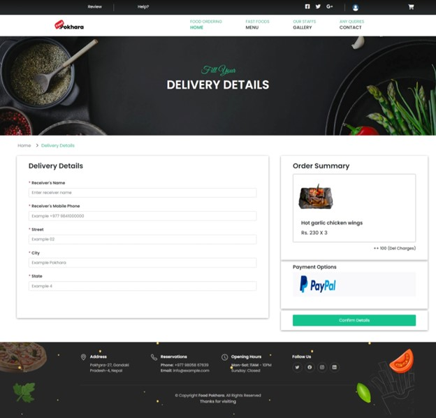
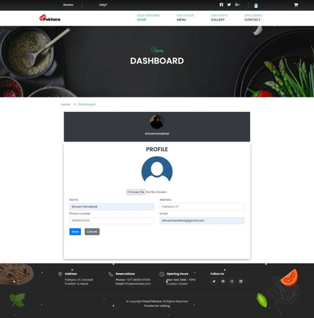

* A repo that contains a complete food ordering system with paypal integration. 
* It also contains admin panel. (Just Hit /Admin/login in the URI and register and confirm to enter the admin panel)

* Here are some interfaces of the system
<============ Index Page =========>
1. Index Page

<============ Login Page =========>
2. Login Page

<============ Item Details Page =========>
3. Item Details Page (You can rate and comment for an item)

<============ Cart Page =========>
4. Cart Page

<============ Delivery Page =========>
5. Delivery Page

<============ Profile Page =========>
6. Profile Page

<============ Order History Page =========>
7. Order History Page
